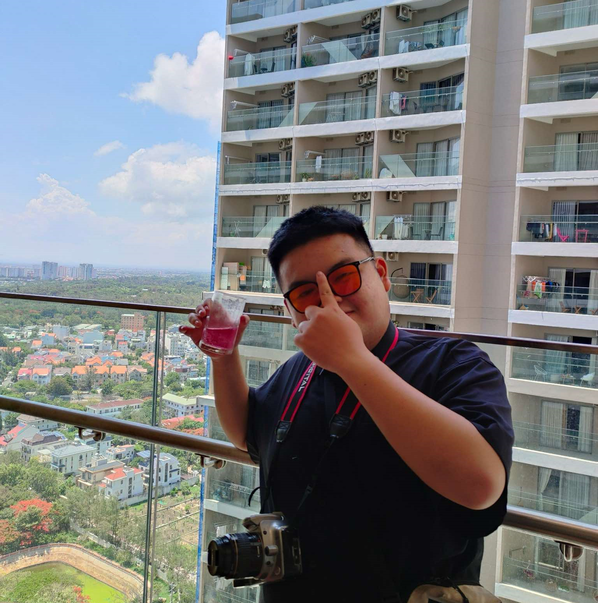

# Project Description: Personal Portfolio Website

## Website : https://nxhai0913.vercel.app/

This project is a personal portfolio website for showcasing my skills, projects, and contact information. 

It is designed to provide a professional online presence and serve as a comprehensive introduction to potential employers, clients, and collaborators.

## Key Features:

### Responsive Design:

The website is fully responsive, ensuring optimal viewing experiences across various devices, including desktops, tablets, and smartphones.

### Navigation:

A smooth and intuitive navigation bar allows users to easily access different sections of the website, including Home, About, Skills, Projects, and Contact.

### Home Section:

The homepage features a personalized card with a profile picture, name, title, and social media links, providing a quick overview of my professional identity.

### Skills Section:

A dedicated section showcasing my technical skills with relevant icons, including C++, JavaScript, Python, HTML, CSS, Node.js, React, GitHub, Git, and VS Code.

